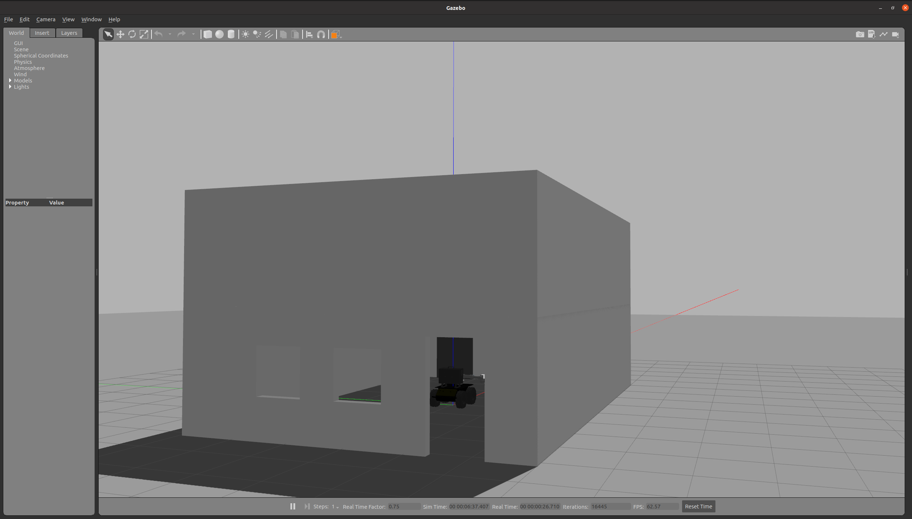
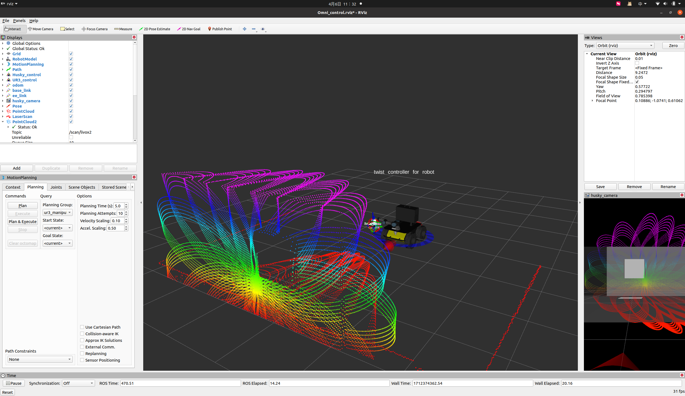

# 主要参考项目

[husky仿真源码参照此链接](https://github.com/QualiaT/husky_ur3_simulator)：https://github.com/QualiaT/husky_ur3_simulator

[Livox仿真源码参照此链接](https://github.com/Livox-SDK/livox_laser_simulation)：https://github.com/Livox-SDK/livox_laser_simulation

# 仿真环境运行指令

打开husky+ur3+livox+自建房间gazebo仿真环境

```bash
roslaunch husky_ur3_gazebo husky_ur3_livox.launch
```



打开moveit!以及rviz

```bash
roslaunch husky_ur3_gripper_moveit_config Omni_control.launch
```



# 主要文件介绍

`room_10_9_small.world`:房屋模型
